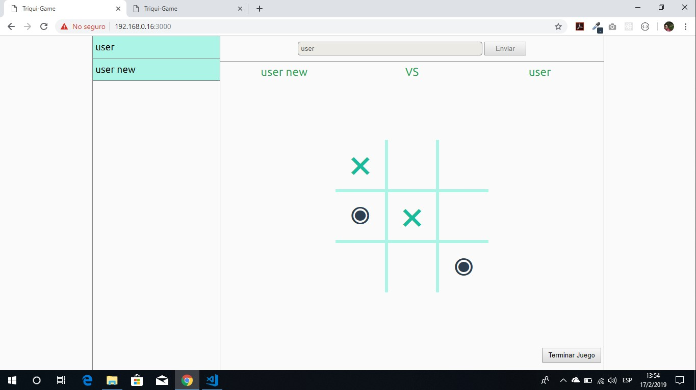
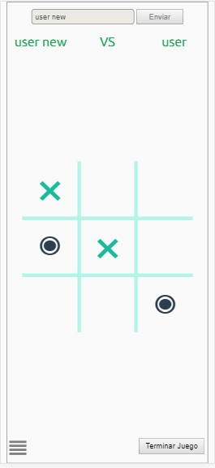

# Tres en linea 
Proyecto construido con nodejs y socket.io
* implementando socket.io para recibir y enviar eventos al cliente
* haciendo uso del fujo de condicionales en js
* <strong>NOTA</strong> utiliza Google Chrome para tener un buen funcionamiento
# Screenshots

    

    

